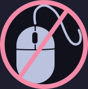
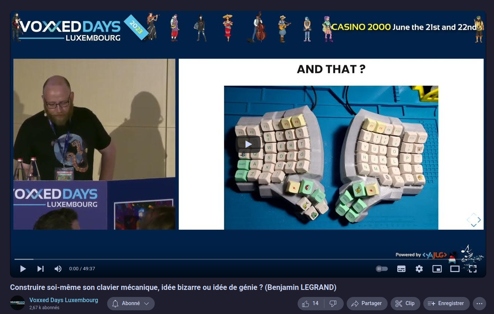
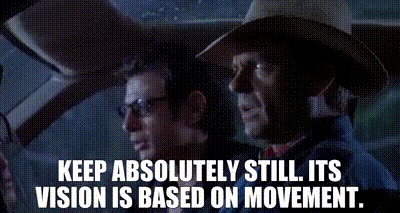
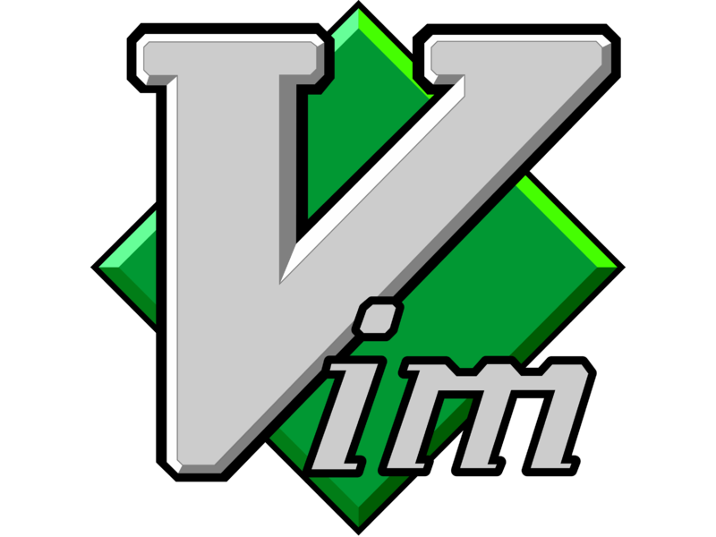
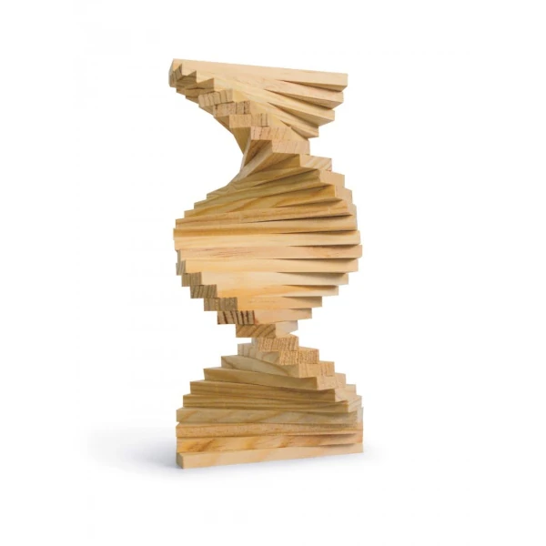
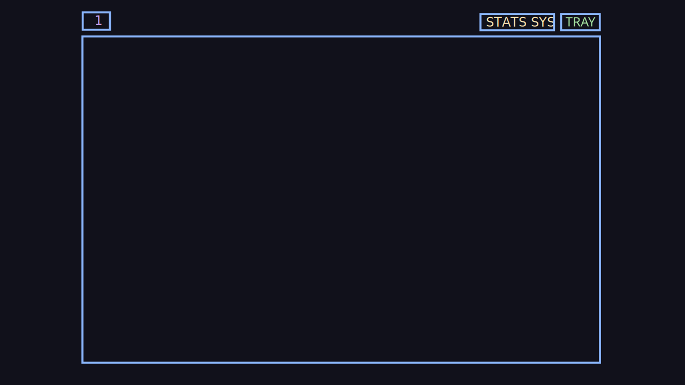

# Pourquoi vous devriez jeter vos souris à la poubelle

<!-- .element: style="width: 20%; height: auto" -->
---
- Bienvenue dans ce talk un peu troll.
- Je vais vous parler de pourquoi, et surtout comment vous pouvez vous passer de votre souris

## HJKL, la joie du mouvement

⬆️  Titre alternatif ⬆️
---
- Avertissement: ça va être un peu à l'arrache
- Je voulais répéter un peu durant ce mois de juin 2024, et au final bon... il s'est passé des choses, j'ai pas eu le temps

### Qui-suis-je ?

- Benjamin Legrand
- Tech Lead / Archi Front<!-- .element: class="fragment" -->
- onepoint / Nantes<!-- .element: class="fragment" -->
- @benjilegnard<!-- .element: class="fragment" -->

### Pourquoi ce talk ?
---
- l'année dernière j'ai fait le tour de france des conférence tech avec un sujets sur les claviers ergonomiques

#### "Construire soi-même son clavier mécanique, idée bizarre ou idée de génie?"

<!-- .element: style="width: 80%; height: auto" -->

---
- je parlais d'ergonomie, et très très rapidement
- j'avais un slide un peu simpliste et condescendant ou je disais : "apprenez les raccourcis de vos app / utilisez les vim motions"
- en vrai c'est pas si simple que ça.
- ici je vais vous parler de comment côté système d'exploitation et logiciels, on peut se passer de souris

#### Tech Conférences Tour
- Camping des speakers 2023
- Riviera DEV 2023 🌴
- Voxxed Days Luxembourg 2023
- Devfest Strasbourg 2023
- Volcamp 2023
- BDX/IO 2023
- Touraine Tech 2024
- Sunny Tech 2024
---
- Je l'ai donnée un peu partout.
- Ce slide est juste là pour flex un peu

## Pourquoi vouloir se séparer de sa souris ?
---
- ou tout du moins éviter de l'utiliser le plus possible

### Fatigue / TMS / Tendinite

- déplacer sa main de son clavier à sa souris,
- c'est fatiguant 😪

### Context-switching

- saisie clavier / navigation souris
- changement de contexte

### Marre de chercher le curseur

Le curseur quand je le cherche :

<!-- .element: style="width: 60%; height: auto" -->

---
- Grosse perte de temps à chaque fois qu'on passe d'un contexte à l'autre

### Accessibilité

- Comme ça vous testerez l'accessibité clavier de vos sites / apps
- 😏
---
- Une grosse partie des problématiques d'accessibilité web est résolue si vos sites sont accessible au clavier.

### La vraie raison

- réduire la friction / optimiser le chemin critique<!-- .element: class="fragment" -->
- vous pensez à faire faire un truc à votre ordinateur 🧠<!-- .element: class="fragment" -->
- il est fait instantanément 🚀<!-- .element: class="fragment" -->

---
- le vrai but et intéret, c'est d'éliminer toutes les petites frictions qui font perdre du temps
- instantanéité entre penser l'action et la réaliser = puissance.

### Avertissement #0

Je suis une bille 🔵

---
- Réellement, les outils que je vais vous présenter là, je ne maitrise pas tout, on va dire 10%.
- Mais le peu que je maitrise me rends déjà 5 à 10 fois plus efficaces que ce que je ne l'étais avant
- j'ai appris sur le tard grâce à des collègues incroyables
- et on continue d'apprendre

### Avertissement #1
- Ceci n'est pas un talk à propos de __vim__
- Mais je vais en parler quand même<!-- .element: class="fragment" -->

---
- Qui utilise vim déjà dans la salle ?
- Qu'est ce que vous faites là, vous êtes déjà convaincu normalement.
- Je vais en parler parce que c'est un peu mon point de départ de tout ça

## Vim
<!-- .element: style="width: 40%; height: auto" -->

### Navigation

- <kbd>H</kbd> <kbd>J</kbd> <kbd>K</kbd> <kbd>L</kbd>
- <kbd>←</kbd> <kbd>↓</kbd> <kbd>↑</kbd> <kbd>→</kbd>

---
- c'est historique
- gauche bas haut droite

### Les modes
- mode `NORMAL`
- mode `INSERT`
- mode `VISUEL`
- et d'autres mais passons<!-- .element: class="fragment" -->

---
- contrairement à d'autres... éditeurs de texte, vim a des modes
- généralement vous êtes en mode édition
- le contexte est bien plus clair grâce à ces modes

### La touche `<Leader>`
- concept commun à plein d'applis linux.
- active une "couche" clavier pleine de commandes

---
- Une notion qu'on va retrouver dans pas mal d'applications un peu complexe
- c'est une touche qui va permettre de lancer des commandes selon la touche qui va suivre
- par défaut sur tmux c'est <kbd>Ctrl</kbd> + <kbd>b</kbd>

### Démo

---
- ok vim c'est cool, mais c'est uniquement un éditeur de texte
- C'est çe qui m'a permis néanmoins de comprendre qu'il y a un monde sans souris
- maintenant on ne fait pas que de l'édition de texte dans la vie, y'a aussi le terminal :D. On va vouloir lancer des commandes

### Avertissement #2

- Ceci n'est pas un talk à propos de __tmux__
- Mais je vais en parler quand même<!-- .element: class="fragment" -->

## Tmux
<!-- .element: style="width: 40%; height: auto" -->

<https://github.com/tmux/tmux/wiki>
---
- Le second outil que je voudrais présenter, c'est tmux

### Multiplexeur de terminal

- Session
- Window
- Panel

---
- Tmux est un multiplexeur de terminal: dans un terminal, vous pouvez avoir plusieurs sessions
- chaque session peut avoir plusieurs fenêtres, chaque fenêtre peut avoir plusieurs panneaux

### Démo
---
- Créer une session
- Split vertical
- Split horizontal
- passer de l'un a l'autre
- sélectionner du texte dans la sortie
- mode visuel et copier coller
- il n'y a pas que le terminal dans la vie, donc niveau système d'exploitation:

## i3 / sway
<!-- .element: style="width: 40%; height: auto" -->

<https://swaywm.org/>
---
- Sway c'est un gestionnaire de fenêtre en carrelage
- de la même maniére que dans tmux on peut passer de panel en panel on fait pareil avec i3 sway

### Tu veux dire OS / Distribution ?

| Windows | MacOS | Linux |
| - | - | - |
|  |   |  |

### Gestionnaire de fenêtres ? 
- on est dans linux, tout est configurable / changeable<!-- .element: class="fragment" -->
- gérer l'affichage de vos fenêtres UNIQUEMENT<!-- .element: class="fragment" -->
- en carrelage<!-- .element: class="fragment" -->

---
- Dans le cas d'i3 et sway, on parle de gestionnaire de fenêtres tiling, c'est-à-dire que les fenêtres sont disposées de manière non superposée, sans chevauchement, de sorte que toutes les fenêtres soient visibles en permanence.
- Quand on parle de gestionnaire de fenêtres, on parle de la couche qui gère les fenêtres, pas de l'OS en lui-même.
- Un compositeur de fenêtres est un logiciel qui gère les fenêtres, les déplacements, les redimensionnements, les superpositions, etc.
- ça n'est pas un environnement bureau complet

### Un peu d'histoire...
| | |
| --- | ------- |
| X11 | Wayland |
| i3  | sway    |

---
- X11: serveur d'affichage historique
- Wayland: tentative de moderniser tout ça (successeur de X11, succès ou pas ? pas le sujet)
- sway port d'i3 donc les mêmes raccourcis / configurations appliquables à l'un ou l'autre

### Principe 
- Les workspaces
- Les fenêtres

---
- Organise vos fenêtres d'applications.
- plutôt simple, principe de Workspace est maintenant dans Windows / MacOS aussi.

### La touche `<Super>`

- c'est la touche `windows` <kbd>⊞</kbd>
- ou touche `command` sur mac <kbd>⌘</kbd>
- `KC_GUI` / Super

---
- C'est elle qui par combinaison avec d'autres touches va vous permettre de manipuler sway/i3.

### Welcome

---
- la première fois qu'on lance sway ou i3, c'est perturbant
- rien n'est cliquable
- il nous manque quelque chose pour lancer nos applications.

### Lancer des applications
- dmenu
- wofi
- rofi
- ou simplement le terminal<!-- .element: class="fragment" -->

---
- Quand on arrive dans une session sway, il n'y a pas de fenêtre ouverte, il n'y a pas de barre de tâche, il n'y a pas de menu démarrer, rien n'est cliquable.
- C'est un peu déroutant au début, mais c'est aussi très libérateur. Vous pouvez tout configurer à votre guise, et vous pouvez tout faire au clavier.
- example emoji picker, vous pouvez en faire ce que vous voulez

### Démo
---
- lancer une application
- changer de workspace
- redimensionner une fenêtre
- naviguer entre les fenêtres
- déplacer une fenêtre
- envoyer une fenêtre sur un autre workspace
- stacked / tabbed / split
- scratchpad

## Personnalisation

🎨

### Waybar

#### Widgets
~/.config/waybar/config

#### CSS
~/.config/waybar/style.css

## Bonuses
(si on a le temps)

### Bonus #0: Vimium

<!-- .element: style="width: 40%; height: auto" -->

<https://vimium.github.io/>

#### Extension navigateur

- [Firefox](https://addons.mozilla.org/en-US/firefox/addon/vimium-ff/)
- [Chrome](https://chromewebstore.google.com/detail/vimium/dbepggeogbaibhgnhhndojpepiihcmeb)

#### Reprends les principes  (et keymaps) de vim

- HJKL
- les modes

#### Démo

---
- naviguer/easymotion (f)
- ouvrir un lien nouvel onglet (F)
- ouvrir un lien de son historique (O)

### Bonus #1: lazygit

<https://github.com/jesseduffield/lazygit>

---
Une des dernières applications que j'arrivais pas à me passser de ma souris, c'était git.
Pas l'usage simple en cli.
Les patchs, navigation dans les branches et l'historique, c'était un peu compliqué.
enter lazygit, le meilleur client git en cli (à mon avis)

### Bonus #2 : cmus

<https://cmus.github.io/>

Lecteur de musique en ligne de commande

### Bonus #3 : Basic terminal shortcuts

Chercher une commande dans l'historique...

<!-- .element: style="width: 40%; height: auto" -->

Source: https://itsfoss.com/linux-terminal-shortcuts/

## Conclusion

### Limites

- évidemment: pas adapté à tout
- dessin / design / 3d / jeux-vidéos / etc

### Avantages

- gain de temps<!-- .element: class="fragment" -->
- performance<!-- .element: class="fragment" -->
- ergonomie<!-- .element: class="fragment" -->
- accessibilité<!-- .element: class="fragment" -->
- personnalisation<!-- .element: class="fragment" -->

---
- gain de temps: pas besoin de chercher sa souris
- performance: pas besoin de bouger sa main, on reste concentré sur la tâche à réaliser
- ergonomie: moins de mouvements, moins de douleurs vous bougez très peu les doigts
- accessibilité: tout le monde n'a pas de souris, tout le monde n'a pas de bras
- personnalisation: on peut tout configurer à sa guise

### Inconvénients

- courbe d'apprentissage<!-- .element: class="fragment" -->
- connaissances linux nécéssaires<!-- .element: class="fragment" -->
- sway: cartes graphiques NVIDIA "non-supportées"<!-- .element: class="fragment" -->

---
- services en taches de fonc pas nécéssaires
- galérer avec les agents ssh, service d'impression
- c'est aussi un intéret, mais vu que vous personnalisez un maximum les outils, c'est difficilement partageable/ pas standardisé

### Hors de linux
- Windows:
  - [GlazeWM](https://github.com/glzr-io/glazewm)
  - [HashTWM](https://github.com/ZaneA/HashTWM)
- Macos:
  - [amethist](https://github.com/ianyh/Amethyst)
  - [yabai](https://github.com/koekeishiya/yabai)
---
- Je ne les ai pas testé, donc à vous de vous faire une idée vous même

### Conclusion
- ~~jeter sa souris à la poubelle~~<!-- .element: class="fragment" -->
- essayez de vous en passer<!-- .element: class="fragment" -->
- vous verrez, c'est pas si difficile<!-- .element: class="fragment" -->
- prenez ça comme un jeu<!-- .element: class="fragment" -->
---
- le but c'est pas de flexer parce que je connais tous ces raccourcis
- le but c'est de réduire la friction entre vous et votre ordinateur
- et de pouvoir vous concentrer uniquement sur ce que vous avez à faire et pas les à côtés
- qu'entre penser l'action, et faire l'action, ca soit indolore, voire instantané

## Merci

@benjilegnard

  

    <h4>⬇️ Slides ⬇️</h4>
    
  

  
  

    <h4>⬇️ Feedback ⬇️</h4>
    
  

---
- Vous pouvez m'envoyez vos questions ou m'insulter sur twitter
- Merci de m'avoir écouté, bisous.
